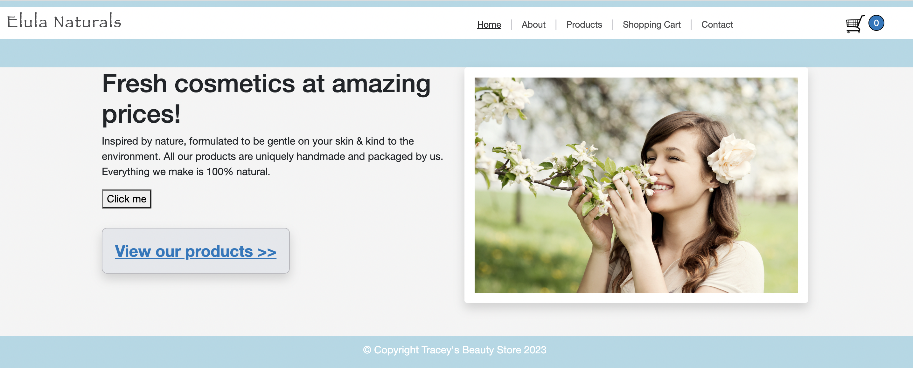

# My Online Beauty Store 
This is an online store that sells Elula beauty products. It has a functional shopping cart that includes forms to allow for discount coupons and delivery options. 

### Table of Contents

    1. Technologies
    2. Installation
    3. Usage
    4. Credits
	
### Technologies

This project uses:
* HTML  
* CSS 
* Javascript
* jQuery
 
### Installation

Download all the files and open index.html in your preferred browser. 
 
### Usage

To use this website, simply click on the navigation links at the top right side of the page and you will be able to jump to navigate through the website. See figure 1 below.

### Deployed app
Deployed the app with vercel. Check the link here: https://online-beauty-store.vercel.app/
### Credits

This website was created by Tracey Turner during the HyperionDev Full Stack Web Development Bootcamp January 2023 [GitHub profile](https://github.com/WrenKudra). 

